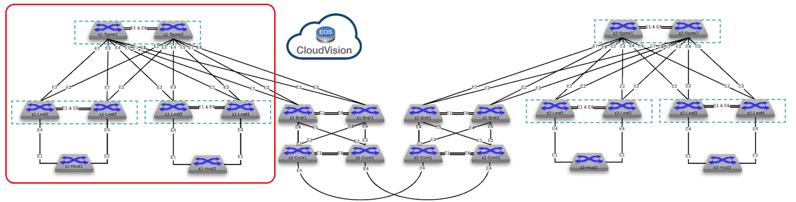

# Arista Network Testing Automation (ANTA) demo

__WIP__ - Documentation is not accurate anymore! Please update it !

This repository is built to support demo about how to use [Arista Network Testing Automation](https://www.anta.ninja) framework.

## Lab environment



## Provision lab

Please follow [this documentation](./docs/provisioning.md) to build lab for the hackathon session.

## Authentication

- Username: __arista__ (password: `atd generated password`)

```bash
export LABPASSPHRASE=`cat /home/coder/.config/code-server/config.yaml| grep "password:" | awk '{print $2}'`
```

If you want to not provide username and password to ANTA for each execution, you can source a file with content similar to the following snippet:

```bash
echo 'Creating default anta variables'
export ANTA_USERNAME=ansible
export ANTA_PASSWORD=${LABPASSPHRASE}
export ANTA_ENABLE=false
```

## Management IPs

| Hostname | Managemnt Interface | IP Address      |
| -------- | ------------------- | --------------  |
| Spine1   | Management0         | 192.168.0.10/24 |
| Spine2   | Management0         | 192.168.0.11/24 |
| Leaf1    | Management0         | 192.168.0.12/24 |
| Leaf2    | Management0         | 192.168.0.13/24 |
| Leaf3    | Management0         | 192.168.0.14/24 |
| Leaf4    | Management0         | 192.168.0.15/24 |
| Host1    | Management0         | 192.168.0.16/24 |
| Host2    | Management0         | 192.168.0.17/24 |

## Available demo

__To be reviewed before GO LIVE__

> **Note**
> Please follow [provisioning process](./docs/provisioning.md) first !

- [Base demo](docs/demo-base.md): Demonstrate [ANTA](www.anta.ninja) capabilities using cEOS as network endpoints
- [Build your test demo](docs/demo-tests.md): Demonstrate how to build your own ANTA tests library
