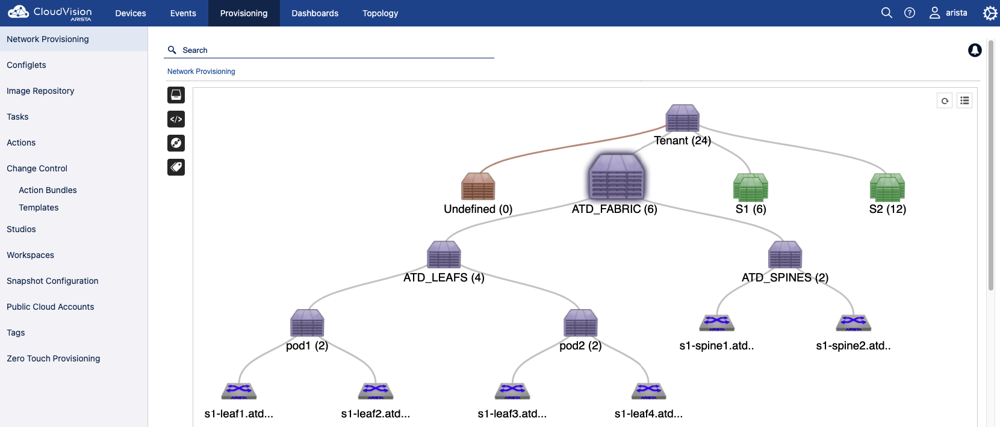

# Lab Provisioning

## Get repository content

```bash
# Move to persistent storage
cd labfiles/

# Clone repository
git clone https://github.com/titom73/anta-malaga.git

# Move to repository
cd anta-malaga
```

## Save Lab Credential

```bash
export LABPASSPHRASE=`cat /home/coder/.config/code-server/config.yaml| grep "password:" | awk '{print $2}'`
```

## Install Ansible & AVD

### Ansible content

```bash
pip install --upgrade pip
pip install --upgrade ansible
ansible-galaxy collection install -f arista.avd
```

### AVD requirements

```bash
ARISTA_AVD_DIR=$(ansible-galaxy collection list arista.avd --format yaml | head -1 | cut -d: -f1)
pip3 install -r ${ARISTA_AVD_DIR}/arista/avd/requirements.txt
```

## Configuration Management

Build configuration and applied to EOS devices in Site 1 using Cloudvision

### Location

```bash
cd atd-inventory/
```

### Build and deploy

> **Warning**
> Please check CVP is running before running next command

```bash
ansible-playbook playbooks/atd-update-topo.yml
```


